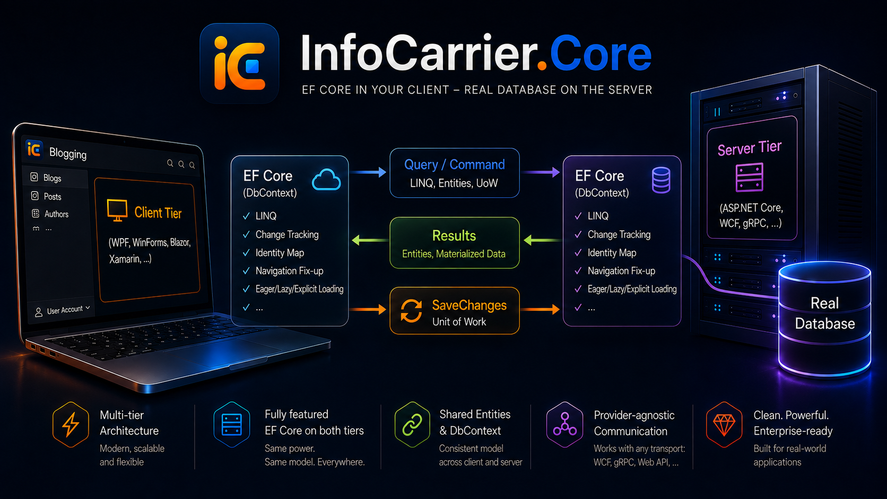

<div align="center">



**Use the full power of Entity Framework Core in a client application that has no database.**

[](https://www.nuget.org/packages/InfoCarrier.Core)
[](https://www.nuget.org/packages/InfoCarrier.Core.AspNetCore)
[](https://dotnet.microsoft.com/)
[](https://github.com/dotnet/efcore)
[](license.txt)

[**Documentation**](https://azabluda.github.io/InfoCarrier.Core/) &nbsp;·&nbsp;
[Samples](samples/) &nbsp;·&nbsp;
[Contributing](CONTRIBUTING.md)

</div>

---

InfoCarrier.Core is a non-relational provider for Entity Framework Core that you deploy on the
*client* side of a multi-tier application. Your client gets a real `DbContext` with LINQ, change
tracking, the identity map, navigation fix-up, lazy loading and transactions, but no connection
string and no database driver. Queries and units of work travel to your application server and run
there against the real database.

## What works

- Queries, including the client/server projection split
- `SaveChanges`, including many-to-many graphs
- Lazy loading, and transactions with savepoints
- Complex types, JSON-mapped owned collections, spatial types, compiled models
- Blazor WebAssembly, published trimmed
- HTTP out of the box. To use gRPC, WCF or a message bus instead, you implement one small
  interface

## What does not

[`docs/limitations.md`](docs/limitations.md) lists every scenario that behaves differently from a
normal EF Core provider, with a worked example for each. It is a short read, and worth doing before
you adopt.

## Getting started

```bash
# client and server
dotnet add package InfoCarrier.Core --version 10.0.0-preview.1

# server endpoint
dotnet add package InfoCarrier.Core.AspNetCore --version 10.0.0-preview.1
```

### The shared model

```csharp
// A project referenced by both the client and the server.
public class NorthwindContext(DbContextOptions<NorthwindContext> options) : DbContext(options)
{
    public DbSet<Customer> Customers => Set<Customer>();
    public DbSet<Order> Orders => Set<Order>();

    protected override void OnModelCreating(ModelBuilder modelBuilder)
        => modelBuilder.Entity<Order>()
            .HasOne(e => e.Customer)
            .WithMany()
            .HasForeignKey(e => e.CustomerId);
}
```

The client and the server must build the same model, so the context and the entity classes live
in a project that both of them reference.

### The client

```csharp
// A WPF, Blazor WebAssembly, MAUI or console app. There is no database in this process.
var serializer = new SystemTextJsonInfoCarrierSerializer();
using var httpClient = new HttpClient { BaseAddress = new Uri("https://your-app-server") };

IInfoCarrierClient client = new TransportInfoCarrierClient(
    new HttpInfoCarrierTransport(httpClient, serializer),
    serializer);

var options = new DbContextOptionsBuilder<NorthwindContext>()
    .UseInfoCarrier(client)
    .Options;

// Everything below this line is ordinary EF Core.
await using var context = new NorthwindContext(options);

var recent = await context.Orders
    .Include(o => o.Customer)
    .Where(o => o.Customer!.Country == "Germany" && o.Freight > 50m)
    .OrderByDescending(o => o.OrderDate)
    .Take(20)
    .ToListAsync();

recent[0].Freight = 0m;
await context.SaveChangesAsync();   // a unit of work, executed on the server
```

That query is not evaluated in the client. It crosses the wire as an expression tree, and the
server runs it against SQL Server, SQLite, PostgreSQL, or whatever provider the server uses.

### The server

```csharp
builder.Services.AddDbContext<NorthwindContext>(o => o.UseSqlite(connectionString));
builder.Services.AddScoped<DbContext>(sp => sp.GetRequiredService<NorthwindContext>());

builder.Services
    .AddSingleton<IInfoCarrierSerializer, SystemTextJsonInfoCarrierSerializer>()
    .AddSingleton<IInfoCarrierServer, InProcessInfoCarrierServer>()
    .AddInfoCarrierStandardValueMappers();

// One endpoint, from InfoCarrier.Core.AspNetCore.
app.MapInfoCarrier();
```

## Credits

Built on [Entity Framework Core](https://github.com/dotnet/efcore) and judged by its test suite.

[InfoCarrier.Core 1.0 to 3.1](https://github.com/azabluda/InfoCarrier.Core/tree/release/3.1), by
[on/off it-solutions gmbh](http://www.onoff-it-solutions.info), proved the idea. It was inspired by
[Remote.Linq](https://github.com/6bee/Remote.Linq) and
[aqua-core](https://github.com/6bee/aqua-core) by Christof Senn, and built on them: they carried the
expression serialization in every version up to 3.1. Version 10 has its own serializer and no longer
depends on them.

MIT, Copyright (c) Alexander Zabluda. See [license.txt](license.txt).
