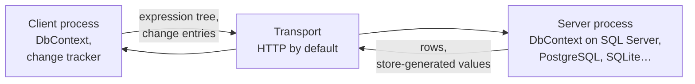

# InfoCarrier.Core

InfoCarrier.Core is an Entity Framework Core provider for the client side of a multi-tier
application. Your client gets a real `DbContext` with LINQ, change tracking, the identity map,
navigation fix-up, lazy loading and transactions, but no connection string and no database driver.
Queries and units of work travel to your application server, which executes them with an ordinary
EF Core provider.

```csharp
// A WPF, Blazor WebAssembly, MAUI or console app.
await using var context = new ShopContext(options);

List<Order> recent = await context.Orders
    .Include(o => o.Customer)
    .Where(o => o.Customer!.Country == "Germany" && o.Freight > 50m)
    .OrderByDescending(o => o.PlacedOn)
    .Take(20)
    .ToListAsync();

recent[0].Freight = 0m;
await context.SaveChangesAsync();   // one unit of work, executed on the server
```

That query crosses the wire as an expression tree. Your server runs it against SQL Server,
PostgreSQL, SQLite, or whatever provider it uses.

<div class="grid cards" markdown>

-   :material-rocket-launch: **[Install it](getting-started/installation.md)**

    Two packages on nuget.org, one for the client and one for the server endpoint.

-   :material-code-braces: **[Build a client and a server](getting-started/first-app.md)**

    A working pair, start to finish, in one page.

-   :material-play-circle: **[Run the samples](getting-started/samples.md)**

    A browser client and a console client, one command each.

-   :material-alert-circle-outline: **[Read the limitations](limitations.md)**

    Every scenario that does not behave like a normal EF Core provider.

</div>

!!! note "Installing"

    ```sh
    dotnet add package InfoCarrier.Core              # client and server
    dotnet add package InfoCarrier.Core.AspNetCore   # server endpoint
    ```

    Both halves need .NET 10 and EF Core 10. If you are moving an application off the earlier
    `3.1` line, see [Upgrading from 3.1](getting-started/upgrading-from-3-1.md).

## Why you might want this

The client composes the query it needs, in an API you already know, against the same `DbContext`
and entity classes the server uses. There is no endpoint per screen, and no DTO layer to keep in
step.

An HTTP transport ships in the package. To use gRPC, a message bus, or a direct call in the same
process, write one small class. `IInfoCarrierTransport` has one method.

## How it fits together



The client's `DbContext` compiles your query and decides which part the server can run. The server
executes that part against its own model, with its own query filters and interceptors.
`SaveChanges` works the same way: the change tracker produces change entries, the server replays
them against a real `DbContext`, and store-generated values come back.

Whatever the server cannot run, the client runs over the rows that came back. That is what makes a
projection with your own method in it work, and it is the cost to watch: a filter the server cannot
translate is applied after the rows have crossed the wire.
[Querying](guide/querying.md) shows which part goes where.

## What works

Queries, including a projection split so that the server does the data access and the client runs
the rest. `SaveChanges` including many-to-many graphs. Explicit and lazy loading, transactions with
savepoints, `ExecuteUpdate` and `ExecuteDelete`, complex types, JSON-mapped collections, spatial
types and compiled models.

Lazy loading costs one round trip for every navigation you touch, a different price here than
against a local database. [Loading related data](guide/loading-related-data.md) compares the three
ways to load. In a browser client it does not work at all, for a reason that is the browser's: see
[Blazor WebAssembly](platforms/blazor-webassembly.md).

The provider runs Microsoft's own EF Core specification suite, the same suite the SQL Server,
SQLite and InMemory providers run:

```
Total tests: 22658, Passed: 22472, Failed: 9, Skipped: 177
```

Every one of the nine is written up on the [limitations](limitations.md) page in terms of the code
that triggers it. The 177 skips are EF Core's own: tests EF itself skips for the store behind
them.

## Security

Your server executes an expression tree that arrived over the network. Deserialization refuses
anything outside a default-deny allowlist over node kinds, types and methods, before your server
sees a tree at all. Authentication and authorization are not in scope and remain yours. The
[security page](security.md) has the detail.
