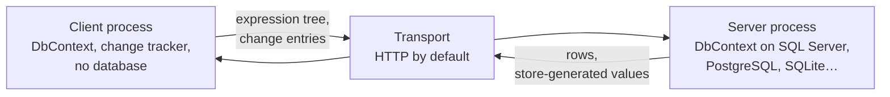

# InfoCarrier.Core

**Use the full power of Entity Framework Core in a client application that has no database.**

InfoCarrier.Core is an Entity Framework Core provider you put on the *client* side of a multi-tier
application. Your client gets a real `DbContext` with LINQ, change tracking, the identity map,
navigation fix-up, lazy loading and transactions, but no connection string and no database driver.
Queries and units of work travel to your application server and run there against the real
database.

```csharp
// A WPF, Blazor WebAssembly, MAUI or console app. There is no database in this process.
await using var context = new ShopContext(options);

List<Order> recent = await context.Orders
    .Include(o => o.Customer)
    .Where(o => o.Customer!.Country == "Germany" && o.Freight > 50m)
    .OrderByDescending(o => o.PlacedOn)
    .Take(20)
    .ToListAsync();

recent[0].Freight = 0m;
await context.SaveChangesAsync();   // one unit of work, executed on the server
```

That query is not evaluated on the client. It crosses the wire as an expression tree, and your
server runs it against SQL Server, PostgreSQL, SQLite, or whatever provider the server uses.

<div class="grid cards" markdown>

-   :material-rocket-launch: **[Install it](getting-started/installation.md)**

    Two packages on nuget.org, and what each one costs you.

-   :material-code-braces: **[Build a client and a server](getting-started/first-app.md)**

    A working pair, start to finish, in one page.

-   :material-play-circle: **[Run the samples](getting-started/samples.md)**

    A browser client and a console client, one command each.

-   :material-alert-circle-outline: **[Read the limitations](limitations.md)**

    Every scenario that does not behave like a normal EF Core provider.

</div>

## Why you might want this

Your client writes the query it needs, against the same entity classes the server uses. There is no
endpoint per screen, no DTO per endpoint, and no second set of types to keep in sync. The API is EF
Core, so there is nothing new to learn on the client.

HTTP ships in the box. To send requests over gRPC or a message bus instead, you implement one small
interface.

## How it fits together



The client's `DbContext` compiles your LINQ query, decides which part of it the server can run, and
sends that part. The server executes it against its own model, with its own query filters and its
own interceptors, and sends rows back. The client materializes them into tracked entities and runs
whatever was left of the query locally.

`SaveChanges` works the same way: the client's change tracker produces a set of change entries, the
server replays them against a real `DbContext`, and store-generated values come back.

## What works

Queries, the client/server split of a projection, `SaveChanges` including many-to-many graphs,
lazy loading, explicit loading, transactions with savepoints, `ExecuteUpdate`/`ExecuteDelete`,
complex types, JSON-mapped collections, spatial types and compiled models.

The provider is judged by Microsoft's own Entity Framework Core specification suite, the same suite
EF Core's SQL Server, SQLite and InMemory providers run. The failures that remain are written up on
the [limitations](limitations.md) page in terms of the code that triggers them.

!!! warning "This is a preview"

    ```bash
    dotnet add package InfoCarrier.Core --version 10.0.0-preview.1
    ```

    **Name the version.** `InfoCarrier.Core` has been on nuget.org since 1.0, and an unversioned
    install resolves to its newest *stable* release, `3.1.1`, which was built for EF Core 3.1. See
    [Installation](getting-started/installation.md).

    **Coming from `3.1`?** This is a rewrite and it is not backward compatible. Your model carries
    over; the wiring around it does not. See
    [Upgrading from 3.1](getting-started/upgrading-from-3-1.md).

    A gRPC binding and streaming results as `IAsyncEnumerable` are still to come, and both may
    change the transport interface.

## Security in one paragraph

Your server executes an expression tree that arrived over the network. That path is bounded by a
default-deny allowlist over node kinds, types and methods, no assembly loaded to satisfy a payload,
blocked reflection entry points, and a size bound on what will be deserialized. Authentication and
authorization are not in scope and remain yours: authenticate the transport, and use query filters
on the server's model to decide what a caller may see. The [security page](security.md) is the
longer version.
