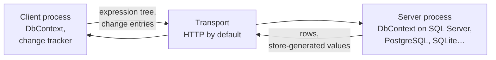

# InfoCarrier.Core

InfoCarrier.Core is an Entity Framework Core provider for the client side of a multi-tier
application. Your client gets a real `DbContext` with LINQ, change tracking, the identity map,
navigation fix-up, lazy loading and transactions, but no connection string and no database driver.
Queries and units of work travel to your application server, which executes them with an ordinary
EF Core provider.

```csharp
// A WPF, Blazor WebAssembly, MAUI or console app.
await using var context = new ShopContext(options);

List<Order> recent = await context.Orders
    .Include(o => o.Customer)
    .Where(o => o.Customer!.Country == "Germany" && o.Freight > 50m)
    .OrderByDescending(o => o.PlacedOn)
    .Take(20)
    .ToListAsync();

recent[0].Freight = 0m;
await context.SaveChangesAsync();   // one unit of work, executed on the server
```

That query is not evaluated on the client. It crosses the wire as an expression tree, and your
server runs it against SQL Server, PostgreSQL, SQLite, or whatever provider the server uses.

<div class="grid cards" markdown>

-   :material-rocket-launch: **[Install it](getting-started/installation.md)**

    Two packages on nuget.org, one for the client and one for the server endpoint.

-   :material-code-braces: **[Build a client and a server](getting-started/first-app.md)**

    A working pair, start to finish, in one page.

-   :material-play-circle: **[Run the samples](getting-started/samples.md)**

    A browser client and a console client, one command each.

-   :material-alert-circle-outline: **[Read the limitations](limitations.md)**

    Every scenario that does not behave like a normal EF Core provider.

</div>

!!! note "Installing"

    ```sh
    dotnet add package InfoCarrier.Core --version 10.0.0-preview.1
    ```

    Use the `--version` option. Without it, NuGet resolves the newest stable release, which belongs
    to the earlier 3.1 line and is not compatible with this one. If you are moving an application
    off that line, see [Upgrading from 3.1](getting-started/upgrading-from-3-1.md).

## Why you might want this

A rich client that needs more than a REST façade otherwise costs an endpoint per screen and a DTO
per endpoint. Here the client composes the query it needs, in an API you already know, against the
same `DbContext` and entity classes the server uses.

HTTP is included. To use gRPC, a message bus, or a direct call in the same process, write one small
class. `IInfoCarrierTransport` has one method.

## How it fits together



The client's `DbContext` compiles your query, decides which part the server can run, and sends that
part. The server executes it against its own model, with its own query filters and interceptors,
and returns rows. The client materializes them into tracked entities and runs whatever is left
locally. `SaveChanges` works the same way: the change tracker produces a set of change entries, the
server replays them against a real `DbContext`, and store-generated values come back.

## What works

Queries, the client/server split of a projection, `SaveChanges` including many-to-many graphs, lazy
loading, explicit loading, transactions with savepoints, `ExecuteUpdate` and `ExecuteDelete`,
complex types, JSON-mapped collections, spatial types and compiled models.

The provider runs Microsoft's own EF Core specification suite, the same suite the SQL Server,
SQLite and InMemory providers run:

```
Total tests: 22658, Passed: 22472, Failed: 9, Skipped: 177
```

Every one of the nine is written up on the [limitations](limitations.md) page in terms of the code
that triggers it.

## Security

Your server executes an expression tree that arrived over the network, bounded by a default-deny
allowlist over node kinds, types and methods. Authentication and authorization are not in scope and
remain yours. The [security page](security.md) has the detail.
